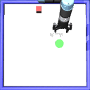

# CMPE591 Homework 3

## Agent Behaviors

### SAC Agent Examples

<table> <tr> <td align="center"><b>Episode 1</b></td> <td align="center"><b>Episode 2</b></td> <td align="center"><b>Episode 3</b></td> <td align="center"><b>Episode 4</b></td> <td align="center"><b>Episode 5</b></td> </tr> <tr> <td></td> <td></td> <td></td> <td></td> <td></td> </tr> </table>

### REINFORCE Agent Examples

<table> <tr> <td align="center"><b>Episode 1</b></td> <td align="center"><b>Episode 2</b></td> <td align="center"><b>Episode 3</b></td> <td align="center"><b>Episode 4</b></td> <td align="center"><b>Episode 5</b></td> </tr> <tr> <td></td> <td></td> <td></td> <td></td> <td></td> </tr> </table>

## Training Analytics

## Reward Progression

The plot below shows how total rewards and distance between obj-goal evolved during training:

### SAC Agent Plots

#### Reward Plot

  

#### Distance Plot

  

### REINFORCE Agent Plots

#### Reward Plot

  

#### Distance Plot

  

